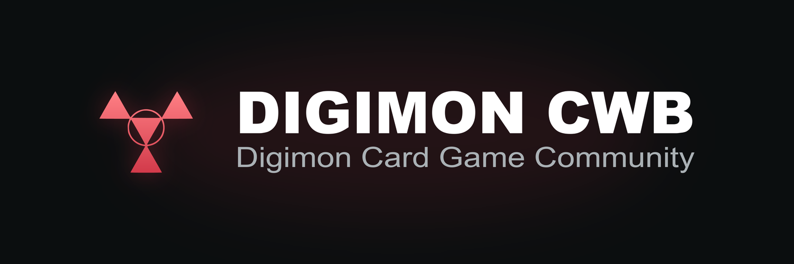

# Acompanhe o Digimon TCG em Curitiba

O **DIGIMON CWB** reúne os torneios, jogadores e decks da comunidade em um só lugar. Consulte resultados, descubra o que está sendo jogado e compartilhe os destaques dos eventos.

**[Abrir o site](https://e-lopes.github.io/)** · [Instagram](https://www.instagram.com/digimoncwb/) · [X](https://x.com/digimon_cwb)

## Tudo sobre os torneios da comunidade

- **Visão geral:** acompanhe os últimos torneios e os decks em destaque nas últimas quatro semanas, por participações, títulos e conversão em Top 4.
- **Torneios:** encontre eventos na lista ou no calendário e confira participantes, classificação e decklists disponíveis.
- **Metagame:** explore os decks do formato atual e filtre por mês, loja e tipo de evento. Os formatos anteriores continuam disponíveis para consulta.
- **Decks e jogadores:** conheça os cadastros da comunidade e acompanhe o histórico de resultados.
- **Criação de conteúdo:** gere posts de pódio e resumo semanal, confira a prévia e baixe a imagem para compartilhar.
- **Deckbuilder:** monte e edite decklists no computador, com busca de cartas, filtros, importação e exportação.

## Comece pelo que interessa a você

**Vai jogar um torneio?** Abra **Torneios** para consultar os eventos e resultados das lojas.

**Quer conhecer o cenário local?** Visite **Metagame**. O formato atual tem prioridade, e cada estatística mostra a amostra disponível para ajudar na leitura dos resultados.

**Quer acompanhar um deck ou jogador?** Abra seu cadastro para ver o histórico e as decklists registradas.

**Organiza eventos?** Use os cadastros de torneios, jogadores e decks. Os resultados podem ser preenchidos manualmente ou importados pelos fluxos disponíveis, com revisão antes de salvar. As ferramentas administrativas exigem acesso autorizado.

## Do seu jeito, no celular ou no computador

A navegação se adapta à tela. Em **Aparência**, escolha entre vermelho, azul, verde e amarelo, confira a prévia e toque em **Aplicar**. A preferência fica salva no navegador.

O deckbuilder é exclusivo para computador. As demais áreas podem ser acessadas pelo celular. Em navegadores compatíveis, o site também pode ser adicionado à tela inicial.

## Ajude a melhorar

Use **Enviar sugestão** ou **Reportar bug**, no final do menu, para compartilhar ideias ou avisar sobre problemas. A **Política de privacidade** e os links da comunidade ficam no mesmo lugar.

## Documentação

[Guia para organizadores e administradores](docs/guides/guia-administradores-digistats.md) · [Documentação geral](docs/README.md)

Para contribuir com o projeto, consulte o [guia de desenvolvimento](docs/development.md). Ele reúne instalação, comandos, arquitetura e informações técnicas.
