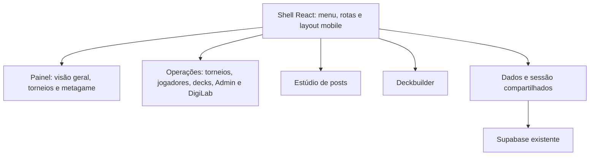

# Arquitetura 2.0: React e micro-frontends

A v2 usa React, TypeScript e Vite. A composição ocorre no navegador: uma aplicação principal carrega módulos ES independentes, descritos em `demo-v2/microfrontends.json`. Não há iframe nem servidor adicional para o frontend. Os arquivos compilados funcionam em hospedagem estática, inclusive em um subdiretório.



| Aplicação | Fonte                      | Responsabilidade                                                                |
| --------- | -------------------------- | ------------------------------------------------------------------------------- |
| Shell     | `frontend/shell/`          | Navegação acessível, menu mobile, carregamento de módulos, falhas e recuperação |
| Dashboard | `frontend/apps/dashboard/` | Componentes React para consultas, filtros, resultados e estatísticas            |
| Workspace | `frontend/apps/workspace/` | Formulários React e adaptação dos controladores de operações consolidados       |
| Studio    | `frontend/apps/studio/`    | Editor React, estado da prévia e exportação local de PNG                        |
| Builder   | `frontend/apps/builder/`   | Formulário React e controlador consolidado de cartas e decklists                |

Cada módulo exporta `apiVersion` e `mount`, que devolve os métodos `update` e `unmount`, conforme [contracts.ts](../frontend/contracts.ts). O contexto fornece navegação, URLs de assets, consultas e carregamento de dependências. Uma falha em um módulo não desmonta o menu nem os demais módulos.

React e React DOM são compilados uma vez e compartilhados por import map em produção. Os quatro módulos têm bundles e comandos de build próprios; são carregados sob demanda e mantidos durante a navegação. Isso preserva formulários e evita reinicializações repetidas dos controladores. Não há React Context entre aplicações: o contrato compartilhado usa dados e funções explícitas.

## Fronteiras e compatibilidade

As operações de cadastro, DigiLab e administração compartilham regras e formulários, por isso pertencem ao mesmo micro-frontend. Separá-las agora em aplicações diferentes duplicaria inicialização, estado de edição e dependências. Painel, estúdio e deckbuilder têm ciclos de carregamento separados.

O painel e o editor de posts usam componentes e estado React. Os formulários das operações e do deckbuilder são gerados como JSX a partir dos templates compartilhados. Os controladores JavaScript de gravação, importação, OCR e decklists continuam atrás de adaptadores com inicialização explícita. Essa etapa migra a composição, a interface e o build; não reescreve todas as regras consolidadas em hooks. O renderer de posts foi separado em `shared/posts/renderer.js` e não depende dos controles da página.

`tools.html` e `torneios/decklist-builder/index.html` são as fontes dos formulários. `scripts/generate-react-forms.mjs` preserva os IDs usados pelos controladores; conteúdos de `<template>` são estáticos. Os componentes gerados não devem ser editados diretamente. A raiz ativa fornece `digiStatsComponentRoot` para os modais e recebe os estilos da v2. O CSS original de suporte fica limitado por `@scope`, e os novos estilos preservam Digital Hazard, paleta, tipografia e zoom de cartas.

Os links `demo-v2/tools.html` e `demo-v2/deckbuilder.html` encaminham para a aplicação React preservando os parâmetros. Os fluxos internos de resultados e jogadores abrem o deckbuilder sem recarregar o documento. Ao voltar, o resultado e o torneio são preservados. A entrada original permanece disponível enquanto a substituição definitiva não é feita.

## Dados e segurança

O shell oferece uma única consulta paginada aos dados reais, com cache em memória e atualização compartilhada. Filtros de formato usam o formato gravado no torneio, sem inferir pela data. Falhas de atualização preservam os últimos dados válidos e mostram um aviso. Cadastros notificam a atualização pelo evento local `digistats:tournaments-changed`.

A sessão continua na mesma origem. O Admin verifica a conta e a participação em `admin_users`; gravações usam o token do usuário e as políticas RLS existentes. Micro-frontends são uma fronteira de organização e carregamento, não uma barreira de autorização. Não existe chave de serviço no frontend.

## Desenvolver e compilar

Requer Node.js 22.19 ou mais recente.

```bash
npm ci
npm run dev
```

O `predev` prepara módulos, templates e manifest. O servidor abre em `http://127.0.0.1:5173/`; alterações nos componentes React usam o servidor Vite e atualização durante o desenvolvimento. Depois de alterar templates de domínio, execute novamente o build para regenerar o JSX.

```bash
npm run build
npm run typecheck
npm run lint
npm run test
```

O build gera `demo-v2/index.html`, aliases, manifest, `demo-v2/app-shell/` e `demo-v2/mfe/`. Os bundles e o JSX gerado estão no `.gitignore`; devem ser gerados no ambiente de publicação. Para uma alteração isolada, use `npm run build:dashboard`, `build:workspace`, `build:studio` ou `build:builder`. Dependências compartilhadas e shell também podem ser compilados com `node scripts/build-frontend.mjs --app=shared` ou `--app=shell`.

Para conferir a saída de produção, sirva a raiz do projeto por HTTP e abra `/demo-v2/`. Publique os bundles gerados junto com os assets e módulos compartilhados do repositório, preservando os caminhos. O artefato de frontend da CI contém os bundles; não inclui sozinho todos os assets de cartas, configurações públicas e controladores. A CI valida build, TypeScript, lint e testes; ela não publica automaticamente a v2.

O formato ESM e `@scope` têm como alvo navegadores atuais, incluindo Safari 17.4 ou mais recente. Não há necessidade de serviços pagos para compilar ou servir a v2.

## Validação realizada

Foram verificados os dados reais, filtros EX12, navegação entre módulos, bloqueio do Admin sem sessão, cadastro manual, retorno do deckbuilder e PNG 1080 × 1350. Os layouts foram conferidos no navegador em desktop e mobile, incluindo 320 e 375 px. Os testes de gravação usam chamadas simuladas; login com conta real, gravação remota e execução de importações DigiLab não foram realizados neste ciclo.
